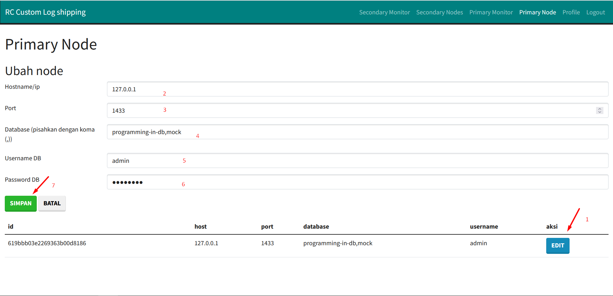

# Script (primary) custom log shipping

## Panduan Pemasangan

### Prerequisite

* [Git](https://git-scm.com/downloads)
* [NodeJs](https://nodejs.org/en/download/) versi v14 atau lebih tinggi
* [Yarn](https://classic.yarnpkg.com/lang/en/docs/install/) versi 1.22
* [MongoDB](https://www.mongodb.com/try/download/community) versi 5.0.3
* [SQL Server](https://www.microsoft.com/en-us/sql-server/sql-server-downloads) versi 2019 Express edition

Pastikan sqlserver memiliki akses baca tulis ke direktori

* `C:\rc_backup\` jika menggunakan **windows**
* `/var/opt/mssql/data/rc_backup/` jika menggunakan **linux**

Kustomisasi direktori dapat dilakukan dengan mengedit berkas `modules/dir/prepareDir.js`

```js
// modules/dir/prepareDir.js
import fs from 'fs';

const prepareDir = (platform) => {
    let dir = '';
    if (platform === 'win32') {
        dir = 'C:\\rc_backup\\';
    } else if (platform === 'linux') {
        dir = '/var/opt/mssql/data/rc_backup/';
    }

    if (!fs.existsSync(dir)) {
        fs.mkdirSync(dir, { recursive: true });
    }
    return dir;
}

export default prepareDir;
```

### Mulai Pemasangan

1. Salin repositori

```bash
git clone https://github.com/rochimfn/tbd-backup-script.git
```

2. Masuk ke direktori

```bash
cd tbd-backup-script
```

3. Pasang dependensi

```bash
yarn 
```

4. Konfigurasi `.env`

```bash
cp .env.example .env #bash atau powershell
copy .env.example .env #cmd
```

Isi konfigurasi dengan kredensial mongodb. Contohnya sebagai berikut:

**Konfigurasi mongodb wajib sama dengan [web monitor](https://github.com/rochimfn/tbd-server-webserver)**
```env
MONGO_HOST='127.0.0.1'
MONGO_PORT='27017'
MONGO_DATABASE='log_shipping'
MONGO_USERNAME='admin'
MONGO_PASSWORD='password'
```

5. Konfigurasi primary node melalui [web monitor](https://github.com/rochimfn/tbd-server-webserver)

**Sistem ini hanya mendukung single primary node saja**




  * Buka halaman Primary Node
  * Tekan tombol EDIT
  * Isi `Hostname/ip` dengan hostname/ip dari server primary yang ingin dipasang log shipping
  * Isi `Port` dengan port dari sql server
  * Isi `Database` dengan daftar database akan digenerate dan dikirim log shipnya (dipisahkan dengan koma)
  * Isi `Username DB` dan `Password DB` dengan kredensial sql server yang memiliki akses generate log dan backup database
  * Tekan tombol `SIMPAN` untuk menyimpan konfigurasi


6. Konfigurasi secondary nodes melalui [web monitor](https://github.com/rochimfn/tbd-server-webserver)

**Sistem ini mendukung multi secondary node**

//TODO


### Backup Script

Script dapat dijalankan dengan perintah berikut:

```
node script.js log
```